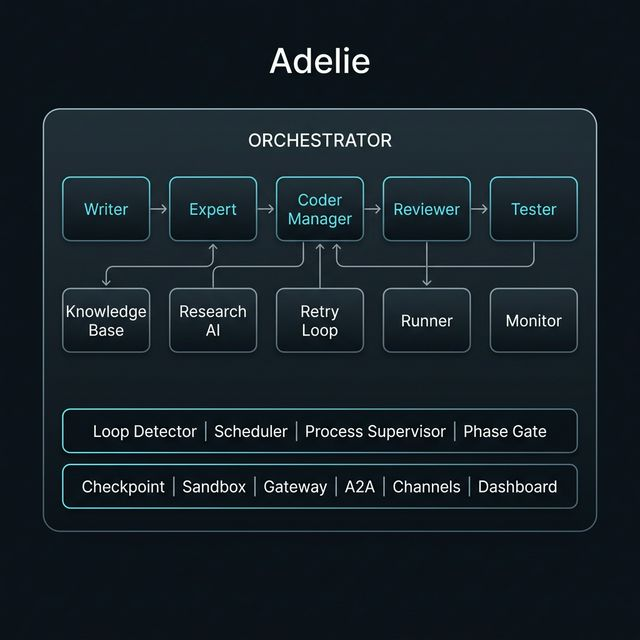

<p align="center">
  
</p>

<h1 align="center">Adelie</h1>

<p align="center">
  <strong>Autonomous AI Orchestration System with Self-Configuring Harness</strong><br/>
  <sub>13+ dynamic agents · adaptive pipeline · policy-enforced safety · production-aware</sub>
</p>

<p align="center">
  <a href="https://www.npmjs.com/package/adelie-ai"></a>
  
  
  
  <a href="./LICENSE"></a>
</p>

<p align="center">
  <a href="#quick-start">Quick Start</a>&ensp;·&ensp;
  <a href="#whats-new-in-v030">What's New</a>&ensp;·&ensp;
  <a href="#architecture">Architecture</a>&ensp;·&ensp;
  <a href="#harness-system">Harness</a>&ensp;·&ensp;
  <a href="#cli">CLI</a>&ensp;·&ensp;
  <a href="#dashboard">Dashboard</a>&ensp;·&ensp;
  <a href="https://ade1ie.github.io/adelie/">Docs</a>&ensp;·&ensp;
  <a href="https://github.com/Ade1ie/adelie/blob/main/CHANGELOG.md">Changelog</a>
</p>

---

## Overview

Adelie is an autonomous AI orchestrator that plans, codes, reviews, tests, deploys, and evolves software projects through a coordinated multi-agent loop. It ships as a single CLI (`npm install -g adelie-ai`) and requires only an LLM provider — no cloud backend, no account.

```
    (o_    Adelie v0.3.0
    //\    gemini · gemini-2.5-pro
    V_/_   Phase: mid_1 | 🛡️3 📡🟢 🧠12/5
```

Unlike simple code-generation tools, Adelie provides a **Harness** — a structural framework that constrains, monitors, and self-corrects the AI at every step:

- 🔧 **Dynamic Pipeline** — The AI reconfigures its own execution pipeline based on project needs
- 🛡️ **Policy Engine** — Declarative constraints block unsafe code before it reaches your project
- 🧠 **Selective Memory** — Phase-aware KB filtering prevents context derailment and hallucination
- 📡 **Production Bridge** — Live CI/CD and error monitoring feeds failures back into the AI loop
- ⛔ **Human Intercept** — Stop the AI instantly at any moment from CLI or Dashboard

---

## What's New in v0.3.0

v0.3.0 is a major architectural evolution. The AI no longer just executes a fixed pipeline — it **understands, adapts, and self-corrects** its own operational structure.

### 🔧 Meta Harness — Dynamic Pipeline (v0.2.16)

The static 6-phase pipeline is now a **dynamic JSON state machine**. The Expert AI can analyze a project and restructure the execution flow at runtime.

```bash
# Expert AI decides: "This project needs a security audit phase"
# → MODIFY_HARNESS action creates solidity_auditor agent + Security Audit phase
# → Pipeline automatically restructured: mid → security_audit → mid_1
```

- **HarnessManager** — Loads/saves/validates JSON-based pipeline configurations
- **DynamicAgent** — Runtime-configurable agents with 3-tier permissions (observer → analyst → operator)
- **Snapshot Rollback** — Every modification creates a backup; failed changes auto-revert

### 🛡️ Policy Engine — Declarative Constraints (v0.2.17)

Define project-specific rules in `.adelie/constraints.yaml` that the AI **cannot violate**:

```yaml
rules:
  - name: orm-only
    type: ast
    description: "DB queries must use ORM"
    check: no_raw_sql

  - name: timeout-required
    type: pattern
    pattern: 'requests\.(get|post|put|delete)\('
    negative_pattern: 'timeout='
    description: "HTTP calls must include timeout"
    severity: block
```

- **AST Analysis** — Python AST checks for `eval()`, `exec()`, wildcard imports, missing docstrings
- **Pattern Matching** — Regex rules with negative pattern support for false positive suppression
- **PolicyGate** — Blocks staging → project promotion on violation; forces Coder retry

### 🧠 Memory Harness — Selective Forgetting (v0.2.18)

Prevents context derailment by controlling what the AI can and cannot see:

- **Phase Scope Filter** — KB files tagged with `phase_scope` are only visible during designated phases
- **Archive Manager** — Resolved errors and completed-phase docs auto-archived after 3 cycles
- **Summary Tree** — `archive/summaries.md` preserves 1-2 line summaries for historical awareness
- **Context Budget** — Only 5% of context window allocated to archived knowledge

### 📡 Production Bridge — CI/CD Feedback Loop (v0.2.19)

Connects the AI loop to external production monitoring:

```
AI deploys code → GitHub Actions fails → Bridge detects CI failure
→ HealthVerdict: CRITICAL → Orchestrator: ERROR state
→ Coder generates hotfix → Deploy again → Bridge confirms: HEALTHY
```

- **GitHub Actions Adapter** — Polls CI status via REST API or MCP
- **Sentry Adapter** — Monitors error spikes above threshold
- **Custom MCP Adapter** — Auto-discovers production monitoring tools
- **Graceful Degradation** — Missing tokens/config = adapter silently disabled

### ⛔ Human Intercept & Monitoring Overhaul (v0.2.20)

Complete CLI and Dashboard redesign for real-time visibility and control:

```bash
> /intercept AI is going in wrong direction
  ⛔ INTERCEPTED
  Cycle: #12
  State: normal → error
  Use /resume to continue with recovery flow.

> /status
  Status: RUNNING
  Phase: mid_1  |  State: normal  |  Cycle: 5
  🛡️ Policy Engine: 3 rules (2 pattern, 1 ast)
  🧠 Memory Harness: 12 active / 5 archived / 3 scoped
  📡 Production: HEALTHY (github_actions, sentry)
  🔧 Pipeline: 6 phases, 13 agents
```

**New CLI Commands:** `/intercept`, `/policy`, `/health`, `/memory`, `/harness`

**Dashboard Panels:** Intercept button, Production Health, Policy Engine, Memory Harness, Pipeline Visualizer

> See [CHANGELOG.md](./CHANGELOG.md) for complete release history.

---

## Quick Start

### Prerequisites

| Requirement | Version |
|:--|:--|
| Python | 3.10+ |
| Node.js | 16+ |
| LLM | Gemini API key **or** Ollama instance |

### Install

#### npm (recommended)

```bash
npm install -g adelie-ai
```

#### curl (macOS / Linux)

```bash
curl -fsSL https://raw.githubusercontent.com/Ade1ie/adelie/main/install.sh | bash
```

#### PowerShell (Windows)

```powershell
irm https://raw.githubusercontent.com/Ade1ie/adelie/main/install.ps1 | iex
```

#### Homebrew (macOS / Linux)

```bash
brew tap Ade1ie/tap
brew install adelie
```

#### From source

```bash
git clone https://github.com/Ade1ie/adelie.git
cd adelie
pip install -r requirements.txt
python -c "from adelie.cli import main; main()"
```

### Update

```bash
# Built-in update checker
adelie --update

# or manual
npm install -g adelie-ai@latest

# Homebrew
brew upgrade adelie

# Check current version
adelie --version
```

### Configure

```bash
cd your-project/
adelie init

# Gemini
adelie config --provider gemini --api-key YOUR_KEY

# or Ollama (local, free)
adelie config --provider ollama --model gemma3:12b
```

### Run

```bash
# Continuous autonomous loop
adelie run --goal "Build a REST API for task management"

# Single cycle
adelie run --once --goal "Analyze and document the codebase"

# Resume a saved workspace
adelie run ws 1
```

The real-time **dashboard** opens automatically at **http://localhost:5042**.

---

## How It Works

### Agents

| Agent | Role | When |
|:--|:--|:--|
| **Writer** | Curates Knowledge Base — skills, logic, dependencies, exports | Every cycle |
| **Expert** | Strategic JSON decisions — action + coder tasks + phase vote | Every cycle |
| **Scanner** | Scans existing codebase on first run | Once |
| **Coder** | Multi-layer code generation with dependency ordering | On demand |
| **Reviewer** | Quality review (1–10 score) with retry-on-reject | After coding |
| **Tester** | Executes tests, collects failures, feeds back to coder | After review |
| **Runner** | Installs deps, builds, deploys (whitelisted commands) | Mid-phase + |
| **Monitor** | System health, resource checks, service restarts | Periodic |
| **Analyst** | Trend analysis, market insights, KB synthesis | Periodic |
| **Research** | Web search → KB for external knowledge | On demand |
| **Inform** | Human-readable project reports and status summaries | On demand |
| **Dynamic** | Runtime-created agents (security auditor, ML trainer, etc.) | On demand |

### Adaptive Lifecycle

```
initial → mid → mid_1 → mid_2 → late → evolve
                  ↑
          Expert AI can insert custom
          phases here at runtime
```

Each phase transition is gated by quality metrics — KB file count, test pass rate, review scores, stability indicators. The Expert AI votes on phase transitions; the Harness enforces the gates.

### Harness System

The Harness is what makes Adelie different from a simple AI code generator. It's a **structural framework** that constrains and protects the AI:

```
┌─────────────────────────────────────────────────┐
│                  HARNESS LAYER                   │
│                                                  │
│  ┌──────────┐ ┌──────────┐ ┌──────────┐        │
│  │ Policy   │ │ Memory   │ │Production│        │
│  │ Engine   │ │ Harness  │ │ Bridge   │        │
│  │          │ │          │ │          │        │
│  │constraints│ │phase scope│ │CI/CD     │        │
│  │AST check │ │archiving │ │Sentry    │        │
│  │pattern   │ │summaries │ │GitHub    │        │
│  └────┬─────┘ └────┬─────┘ └────┬─────┘        │
│       │            │            │               │
│  ┌────▼────────────▼────────────▼─────┐         │
│  │         ORCHESTRATOR               │         │
│  │  cycle start → agents → promote    │         │
│  └────────────────────────────────────┘         │
│                                                  │
│  ┌──────────┐ ┌──────────┐                      │
│  │ Harness  │ │ Human    │                      │
│  │ Manager  │ │ Intercept│                      │
│  │          │ │          │                      │
│  │dynamic   │ │/intercept│                      │
│  │pipeline  │ │dashboard │                      │
│  │rollback  │ │⛔ button │                      │
│  └──────────┘ └──────────┘                      │
└─────────────────────────────────────────────────┘
```

### Security

Adelie enforces multiple security layers:

- **Policy Engine** — Declarative constraints block AST violations, forbidden patterns, and file limits
- **Shell injection prevention** — `BLOCKED_CHARS` filter blocks `&`, `>`, `|`, `;`, backticks
- **Path traversal protection** — `Path.resolve()` verification ensures files stay within staging
- **Staging isolation** — Code is written to `.adelie/staging/` first, verified, then promoted
- **Thread-safe operations** — `_usage_lock` and `_staging_lock` prevent race conditions
- **Whitelisted commands** — Runner and Tester only execute pre-approved command patterns

---

## Architecture

<p align="center">
  
</p>

---

## Dashboard

Adelie serves a real-time monitoring UI at **`http://localhost:5042`** (auto-starts with `adelie run`).

- **Agent grid** — live status of all agents (idle / running / done / error)
- **⛔ Intercept button** — emergency stop from the browser
- **Production Health** — real-time verdict badge (🟢 HEALTHY / 🟡 DEGRADED / 🔴 CRITICAL)
- **Policy Engine** — active rule count and type breakdown
- **Memory Harness** — active/archived/scoped file counters
- **Pipeline Visualizer** — horizontal phase flow with active/completed highlighting
- **Log stream** — real-time SSE-powered log feed with category filtering
- **Cycle metrics** — tokens, LLM calls, files written, test results, review scores
- **Cycle history chart** — last 30 cycles at a glance

Built with zero external dependencies — Python `http.server` + SSE + embedded HTML/JS.

| Setting | Default | Env var |
|:--|:--|:--|
| Enable | `true` | `DASHBOARD_ENABLED` |
| Port | `5042` | `DASHBOARD_PORT` |

---

## CLI

```bash
adelie --version                  # Show version
adelie --update                   # Check for updates
adelie help                       # Full command reference
```

### Workspace

```bash
adelie init [dir]                 # Initialize .adelie workspace
adelie ws                         # List all workspaces
adelie ws remove <N>              # Remove workspace
adelie scan                       # Scan existing codebase → KB
```

### Execution

```bash
adelie run --goal "…"             # Start continuous loop
adelie run --once --goal "…"      # Single cycle
adelie run ws <N>                 # Resume workspace #N
```

### Interactive Commands (REPL)

| Command | Action |
|:--|:--|
| `/help` | Show all commands |
| `/status` | Full system status (all features) |
| `/pause` | Pause before next cycle |
| `/resume` | Resume from pause |
| `/intercept [reason]` | ⛔ Immediate stop + ERROR state |
| `/feedback <msg>` | Send feedback to AI |
| `/policy` | Policy Engine rules & status |
| `/health` | Production health & signals |
| `/memory` | Memory Harness statistics |
| `/harness` | Pipeline structure & agents |
| `/plan` | View pending plan (Plan Mode) |
| `/approve` | Approve pending plan |
| `/reject [reason]` | Reject pending plan |
| `/exit` | Stop and exit |

### Configuration

```bash
adelie config                     # Show current config
adelie config --provider ollama   # Switch LLM provider
adelie config --model gemma3:12b  # Set model
adelie config --api-key KEY       # Set Gemini API key
adelie config --plan-mode true    # Enable Plan Mode (human approval)
```

### Monitoring

```bash
adelie status                     # System health & provider status
adelie inform                     # AI-generated project report
adelie phase                      # Show current phase
adelie metrics                    # Cycle metrics & history
adelie metrics --agents           # Per-agent token usage
```

### Knowledge Base & Project

```bash
adelie kb                         # KB file counts by category
adelie kb --clear-errors          # Clear error files
adelie goal                       # Show project goal
adelie goal set "…"               # Set project goal
adelie feedback "message"         # Inject feedback into AI loop
adelie research "topic"           # Web search → KB
adelie spec load <file>           # Load spec (MD/PDF/DOCX) into KB
```

---

## Configuration

### Environment (`.adelie/.env`)

| Variable | Default | Description |
|:--|:--|:--|
| `LLM_PROVIDER` | `gemini` | `gemini` or `ollama` |
| `GEMINI_API_KEY` | — | Google Gemini API key |
| `GEMINI_MODEL` | `gemini-2.0-flash` | Gemini model name |
| `OLLAMA_BASE_URL` | `http://localhost:11434` | Ollama server URL |
| `OLLAMA_MODEL` | `llama3.2` | Ollama model name |
| `LOOP_INTERVAL_SECONDS` | `30` | Cycle interval in seconds |
| `DASHBOARD_ENABLED` | `true` | Dashboard on/off |
| `DASHBOARD_PORT` | `5042` | Dashboard port |
| `PLAN_MODE` | `false` | Require approval before execution |
| `SANDBOX_MODE` | `none` | `none`, `seatbelt`, or `docker` |
| `PRODUCTION_BRIDGE_ENABLED` | `false` | Enable Production Bridge |
| `PRODUCTION_POLL_INTERVAL` | `60` | Bridge polling interval (seconds) |

### Policy Engine (`.adelie/constraints.yaml`)

```yaml
rules:
  - name: no-eval
    type: pattern
    pattern: '\beval\s*\('
    description: "Block eval() calls"
    severity: block

  - name: docstrings
    type: ast
    check: missing_docstring
    description: "Public functions must have docstrings"
    severity: warn
```

### Production Bridge

```bash
# .adelie/.env
PRODUCTION_BRIDGE_ENABLED=true

# GitHub Actions
GITHUB_TOKEN=ghp_xxxxx

# Sentry
SENTRY_AUTH_TOKEN=sntrys_xxxxx
SENTRY_ORG=my-org
SENTRY_PROJECT=my-project
```

Or add MCP servers to `.adelie/mcp.json` for MCP-based monitoring.

---

## Platform Features

| Feature | Description |
|:--|:--|
| 🔧 **Meta Harness** | Dynamic pipeline — AI reconfigures its own execution structure |
| 🛡️ **Policy Engine** | Declarative constraints block unsafe code at AST/pattern level |
| 🧠 **Memory Harness** | Phase-aware KB filtering prevents context derailment |
| 📡 **Production Bridge** | Live CI/CD + Sentry + MCP monitoring with auto-rollback |
| ⛔ **Human Intercept** | Instant mid-cycle stop from CLI (`/intercept`) or Dashboard |
| 💾 **Checkpoints** | Auto-snapshot before promotion, instant rollback |
| 🐳 **Docker Sandbox** | Configurable workspace isolation, network policy, resource limits |
| 🌐 **REST Gateway** | HTTP API — `/api/status`, `/api/tools`, `/api/control` |
| 🧩 **Skill Registry** | Install/update skills from Git repos or local directories |
| 📡 **Multichannel** | `ChannelProvider` ABC — Discord, Slack, custom channels |
| 🤝 **A2A Protocol** | Agent-to-Agent HTTP for external agent integration |
| 🔧 **MCP Support** | Model Context Protocol for external tool ecosystems |
| 📊 **Dashboard** | Real-time web UI with feature panels, intercept, and SSE streaming |
| 🔄 **Loop Detector** | 5 stuck-pattern types with escalating interventions |
| ⚡ **Scheduler** | Per-agent frequency control with cooldown/priority |
| 🔒 **Security** | Shell injection prevention, path traversal protection, staging isolation |
| 📋 **Plan Mode** | Human-in-the-loop approval for code changes |

---

## Testing

```bash
python -m pytest tests/ -v    # 748 tests
```

---

## Project Structure

```
adelie/
├── orchestrator.py          # Main loop — state machine + harness integration
├── harness_manager.py       # Dynamic pipeline configuration + rollback
├── policy_engine.py         # Declarative constraint enforcement
├── memory_harness.py        # Selective forgetting + phase-aware KB
├── production_bridge.py     # CI/CD + monitoring feedback loop
├── commands/                # CLI command modules
├── cli.py                   # CLI entry point + argparse routing
├── config.py                # Configuration & env loading
├── llm_client.py            # LLM abstraction (Gemini + Ollama + fallback)
├── interactive.py           # REPL + dashboard + intercept commands
├── dashboard.py             # Real-time web server (HTTP + SSE)
├── dashboard_html.py        # Embedded dashboard UI template
├── agents/                  # 12+ specialized AI agents
│   ├── writer_ai.py         #   Knowledge Base curator
│   ├── expert_ai.py         #   Strategic decision maker
│   ├── coder_ai.py          #   Code generator
│   ├── coder_manager.py     #   Layer dispatch & retry
│   ├── reviewer_ai.py       #   Quality reviewer
│   ├── tester_ai.py         #   Test runner
│   ├── runner_ai.py         #   Build & deploy
│   ├── monitor_ai.py        #   Health monitor
│   ├── analyst_ai.py        #   Trend analyzer
│   ├── research_ai.py       #   Web researcher
│   ├── inform_ai.py         #   Status report generator
│   ├── scanner_ai.py        #   Initial codebase scanner
│   └── dynamic_agent.py     #   Runtime-created agents
├── utils/
│   └── ast_checker.py       #   AST-based static analysis
├── kb/                      # Knowledge Base (retriever + embeddings)
├── channels/                # Multichannel providers (Discord, Slack)
├── a2a/                     # Agent-to-Agent protocol
├── checkpoint.py            # Snapshot & rollback
├── sandbox.py               # Docker/Seatbelt isolation
├── gateway.py               # REST API gateway
├── skill_manager.py         # Skill registry
├── plan_mode.py             # Plan Mode (human approval)
├── loop_detector.py         # Stuck-pattern detection
├── scheduler.py             # Per-agent scheduling
├── phases.py                # Lifecycle phase definitions (compat shim)
├── hooks.py                 # Event-driven plugin system
└── process_supervisor.py    # Subprocess management
```

---

## Contributing

```bash
git clone https://github.com/Ade1ie/adelie.git
cd adelie
pip install -r requirements.txt
python -m pytest tests/ -v   # Ensure all tests pass
```

1. Fork → branch → implement → test → PR
2. Follow existing code style and patterns
3. Add tests for new features

---

## Links

- 📖 [Documentation](https://ade1ie.github.io/adelie/) — Full command reference & guides
- 📋 [Changelog](https://github.com/Ade1ie/adelie/blob/main/CHANGELOG.md) — Release history
- 📦 [npm](https://www.npmjs.com/package/adelie-ai) — `npm install -g adelie-ai`
- 🐛 [Issues](https://github.com/Ade1ie/adelie/issues) — Bug reports

---

## License

[MIT](./LICENSE)

<p align="center">
  <sub>Built with 🐧 by the Adelie team</sub>
</p>
