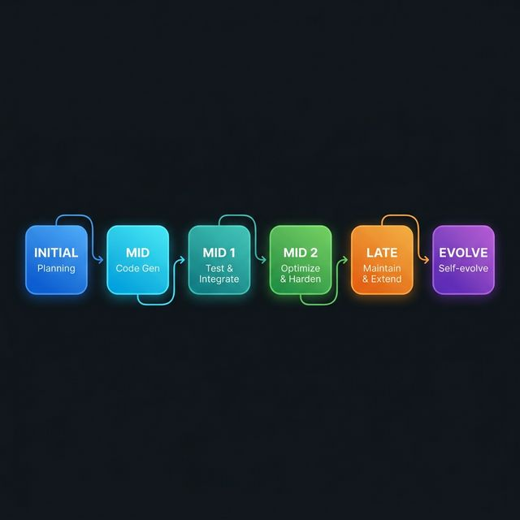

<p align="center">
  
</p>

<h1 align="center">Adelie</h1>

<p align="center">
  <strong>Autonomous AI Orchestration System</strong><br/>
  <sub>10 specialized agents · 6-phase lifecycle · zero human intervention</sub>
</p>

<p align="center">
  <a href="https://www.npmjs.com/package/adelie-ai"></a>
  
  
  
  <a href="./LICENSE"></a>
</p>

<p align="center">
  <a href="#quick-start">Quick Start</a>&ensp;·&ensp;
  <a href="#how-it-works">How It Works</a>&ensp;·&ensp;
  <a href="#architecture">Architecture</a>&ensp;·&ensp;
  <a href="#cli">CLI</a>&ensp;·&ensp;
  <a href="#dashboard">Dashboard</a>&ensp;·&ensp;
  <a href="#configuration">Configuration</a>
</p>

---

## Overview

Adelie is an autonomous AI orchestrator that plans, codes, reviews, tests, deploys, and evolves software projects through a coordinated multi-agent loop. It ships as a single CLI (`npm install -g adelie-ai`) and requires only an LLM provider — no cloud backend, no account.

```
    (o_    Adelie v0.2.1
    //\    ollama · deepseek-v3.1:671b-cloud
    V_/_   Phase: mid_2
```

**What Adelie does in every cycle:**

1. **Writer** curates the Knowledge Base
2. **Expert** makes strategic decisions — what to build next, what to fix
3. **Research** gathers external context from the web
4. **Coder** generates code in 3 dependency layers
5. **Reviewer** scores code quality; rejects until standards are met
6. **Checkpoint** snapshots the project before promotion
7. **Tester** runs tests and reports failures
8. **Runner** builds, installs, deploys
9. **Monitor** watches system health
10. **Phase gates** decide when to advance the project lifecycle

The loop runs continuously at a configurable interval (default 30 s), or once with `adelie run once`.

---

## Quick Start

### Prerequisites

| Requirement | Version |
|:--|:--|
| Python | 3.10+ |
| Node.js | 16+ |
| LLM | Gemini API key **or** Ollama instance |

### Install

#### npm (recommended)

```bash
npm install -g adelie-ai
```

#### curl (macOS / Linux)

```bash
curl -fsSL https://raw.githubusercontent.com/Ade1ie/adelie/main/install.sh | bash
```

#### PowerShell (Windows)

```powershell
irm https://raw.githubusercontent.com/Ade1ie/adelie/main/install.ps1 | iex
```

#### Homebrew (macOS / Linux)

```bash
brew tap Ade1ie/tap
brew install adelie
```

#### From source

```bash
git clone https://github.com/Ade1ie/adelie.git
cd adelie
pip install -r requirements.txt
python adelie/cli.py --version
```

### Update

```bash
# npm
npm install -g adelie-ai@latest

# curl / PowerShell — re-run the install command above

# Homebrew
brew upgrade adelie

# Check current version
adelie --version
```

### Configure

```bash
cd your-project/
adelie init

# Gemini
adelie config --provider gemini --api-key YOUR_KEY

# or Ollama (local, free)
adelie config --provider ollama --model gemma3:12b
```

### Run

```bash
# Continuous autonomous loop
adelie run --goal "Build a REST API for task management"

# Single cycle
adelie run once --goal "Analyze and document the codebase"
```

The real-time **dashboard** opens automatically at **http://localhost:5042**.

---

## How It Works

### Agents

| Agent | Role | When |
|:--|:--|:--|
| **Writer** | Curates Knowledge Base — skills, logic, dependencies, exports | Every cycle |
| **Expert** | Strategic JSON decisions — action + coder tasks + phase vote | Every cycle |
| **Scanner** | Scans existing codebase on first run | Once |
| **Coder** | Multi-layer code generation with dependency ordering | On demand |
| **Reviewer** | Quality review (1–10 score) with retry-on-reject | After coding |
| **Tester** | Executes tests, collects failures, feeds back to coder | After review |
| **Runner** | Installs deps, builds, deploys (whitelisted commands) | Mid-phase + |
| **Monitor** | System health, resource checks, service restarts | Periodic |
| **Analyst** | Trend analysis, insights, KB synthesis | Periodic |
| **Research** | Web search → KB for external knowledge | On demand |

### 6-Phase Lifecycle

<p align="center">
  
</p>

Each phase transition is gated by quality metrics — KB file count, test pass rate, review scores, stability indicators. The Expert AI votes on phase transitions; the system enforces the gates.

### Layered Code Generation

The Coder Manager dispatches tasks across three dependency layers:

- **Layer 0** — Features and pages (parallel execution)
- **Layer 1** — Connectors and integrations (depends on Layer 0)
- **Layer 2** — Infrastructure and configuration (depends on Layer 1)

Failed layers trigger targeted retries with reviewer feedback.

---

## Architecture

<p align="center">
  
</p>

---

## Dashboard

Adelie serves a real-time monitoring UI at **`http://localhost:5042`** (auto-starts with `adelie run`).

- **Agent grid** — live status of all 10 agents (idle / running / done / error)
- **Log stream** — real-time SSE-powered log feed with category filtering
- **Cycle metrics** — tokens, LLM calls, files written, test results, review scores
- **Phase timeline** — visual progress through the 6-phase lifecycle
- **Cycle history chart** — last 30 cycles at a glance

Built with zero external dependencies — Python `http.server` + SSE + embedded HTML/JS.

| Setting | Default | Env var |
|:--|:--|:--|
| Enable | `true` | `DASHBOARD_ENABLED` |
| Port | `5042` | `DASHBOARD_PORT` |

---

## CLI

```bash
adelie --version                  # Show version
adelie help                       # Full command reference
```

### Workspace

```bash
adelie init [dir]                 # Initialize .adelie workspace
adelie ws                         # List all workspaces
adelie ws remove <N>              # Remove workspace
```

### Execution

```bash
adelie run --goal "…"             # Start continuous loop
adelie run once --goal "…"        # Single cycle
adelie run ws <N>                 # Resume workspace #N
```

### Configuration

```bash
adelie config                     # Show current config
adelie config --provider ollama   # Switch LLM provider
adelie config --model gpt-4o     # Set model
adelie config --api-key KEY       # Set Gemini API key
adelie config --ollama-url URL    # Set Ollama server URL
```

### Settings

```bash
adelie settings                   # View all settings
adelie settings --global          # View global settings
adelie settings set <key> <val>   # Change workspace setting
adelie settings set --global <key> <val>  # Change global setting
adelie settings reset <key>       # Reset to default
```

Available settings: `dashboard`, `dashboard.port`, `loop.interval`, `plan.mode`, `sandbox`, `mcp`, `browser.search`, `browser.max_pages`, `fallback.models`, `fallback.cooldown`, `language`

### Monitoring

```bash
adelie status                     # System health & provider status
adelie inform                     # AI-generated project report
adelie phase                      # Show current phase
adelie phase set <phase>          # Set phase manually
adelie metrics                    # Cycle metrics & history
```

### Knowledge Base & Project

```bash
adelie kb                         # KB file counts by category
adelie kb --clear-errors          # Clear error files
adelie kb --reset                 # Reset entire KB
adelie goal                       # Show project goal
adelie goal set "…"               # Set project goal
adelie feedback "message"         # Inject feedback into AI loop
adelie research "topic"           # Web search → KB
adelie spec load <file>           # Load spec (MD/PDF/DOCX) into KB
adelie git                        # Git status & recent commits
```

### Integrations

```bash
adelie telegram setup             # Configure Telegram bot
adelie telegram start             # Start Telegram bot
adelie ollama list                # List Ollama models
adelie ollama pull <model>        # Download model
adelie ollama run [model]         # Interactive chat
```

---

## Configuration

### Environment (`.adelie/.env`)

| Variable | Default | Description |
|:--|:--|:--|
| `LLM_PROVIDER` | `gemini` | `gemini` or `ollama` |
| `GEMINI_API_KEY` | — | Google Gemini API key |
| `GEMINI_MODEL` | `gemini-2.0-flash` | Gemini model name |
| `OLLAMA_BASE_URL` | `http://localhost:11434` | Ollama server URL |
| `OLLAMA_MODEL` | `llama3.2` | Ollama model name |
| `FALLBACK_MODELS` | — | Fallback chain (`gemini:flash,ollama:llama3.2`) |
| `LOOP_INTERVAL_SECONDS` | `30` | Cycle interval in seconds |
| `DASHBOARD_ENABLED` | `true` | Dashboard on/off |
| `DASHBOARD_PORT` | `5042` | Dashboard port |
| `PLAN_MODE` | `false` | Require approval before execution |
| `SANDBOX_MODE` | `none` | `none`, `seatbelt`, or `docker` |

### Docker Sandbox

Optional `.adelie/sandbox.json`:

```json
{
  "docker": {
    "image": "adelie-sandbox:latest",
    "workspaceAccess": "rw",
    "network": "none",
    "memoryLimit": "512m",
    "cpuLimit": 1.0
  }
}
```

### Custom Skills

Place custom skills in `.adelie/skills/<name>/SKILL.md`:

```yaml
---
name: react-specialist
description: React/TypeScript best practices
agents: [coder, reviewer]
trigger: auto
---
Use functional components with TypeScript props…
```

---

## Platform Features

| Feature | Description |
|:--|:--|
| 💾 **Checkpoints** | Auto-snapshot before promotion, instant rollback |
| 🐳 **Docker Sandbox** | Configurable workspace isolation, network policy, resource limits |
| 🌐 **REST Gateway** | HTTP API — `/api/status`, `/api/tools`, `/api/control` |
| 🧩 **Skill Registry** | Install/update skills from Git repos or local directories |
| 📡 **Multichannel** | `ChannelProvider` ABC — Discord, Slack, custom channels |
| 🤝 **A2A Protocol** | Agent-to-Agent HTTP for external agent integration |
| 🔧 **MCP Support** | Model Context Protocol for external tool ecosystems |
| 📊 **Dashboard** | Real-time web UI with SSE streaming on port 5042 |
| 🔄 **Loop Detector** | 5 stuck-pattern types with escalating interventions |
| ⚡ **Scheduler** | Per-agent frequency control with cooldown/priority |

---

## Testing

```bash
python -m pytest tests/ -v    # 197 tests
```

---

## Project Structure

```
adelie/
├── orchestrator.py          # Main loop — state machine + phase gates
├── cli.py                   # All CLI commands
├── config.py                # Configuration & env loading
├── llm_client.py            # LLM abstraction (Gemini + Ollama + fallback)
├── interactive.py           # REPL + dashboard integration
├── dashboard.py             # Real-time web server (HTTP + SSE)
├── dashboard_html.py        # Embedded dashboard UI template
├── agents/                  # 10 specialized AI agents
│   ├── writer_ai.py         #   Knowledge Base curator
│   ├── expert_ai.py         #   Strategic decision maker
│   ├── coder_ai.py          #   Code generator
│   ├── coder_manager.py     #   Layer dispatch & retry
│   ├── reviewer_ai.py       #   Quality reviewer
│   ├── tester_ai.py         #   Test runner
│   ├── runner_ai.py         #   Build & deploy
│   ├── monitor_ai.py        #   Health monitor
│   ├── analyst_ai.py        #   Trend analyzer
│   ├── research_ai.py       #   Web researcher
│   └── scanner_ai.py        #   Initial codebase scanner
├── kb/                      # Knowledge Base (retriever + embeddings)
├── channels/                # Multichannel providers (Discord, Slack)
├── a2a/                     # Agent-to-Agent protocol
├── checkpoint.py            # Snapshot & rollback
├── sandbox.py               # Docker/Seatbelt isolation
├── gateway.py               # REST API gateway
├── skill_manager.py         # Skill registry
├── loop_detector.py         # Stuck-pattern detection
├── scheduler.py             # Per-agent scheduling
├── phases.py                # Lifecycle phase definitions
├── hooks.py                 # Event-driven plugin system
├── process_supervisor.py    # Subprocess management
└── env_strategy.py          # Runtime environment detection
```

---

## Contributing

```bash
git clone https://github.com/Ade1ie/adelie.git
cd adelie
pip install -r requirements.txt
python -m pytest tests/ -v   # Ensure all tests pass
```

1. Fork → branch → implement → test → PR
2. Follow existing code style and patterns
3. Add tests for new features

---

## License

[MIT](./LICENSE)

<p align="center">
  <sub>Built with 🐧 by the Adelie team</sub>
</p>
